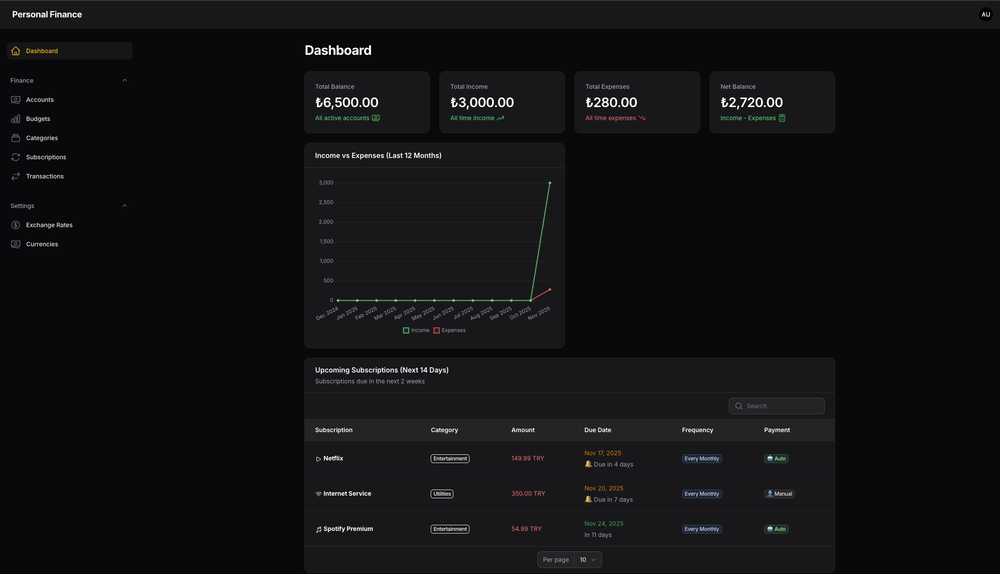
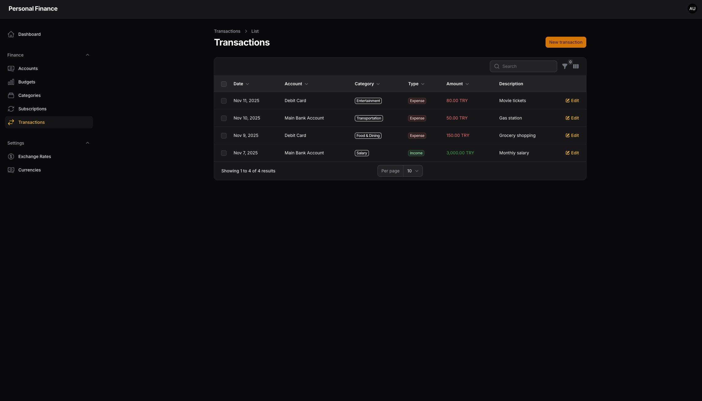
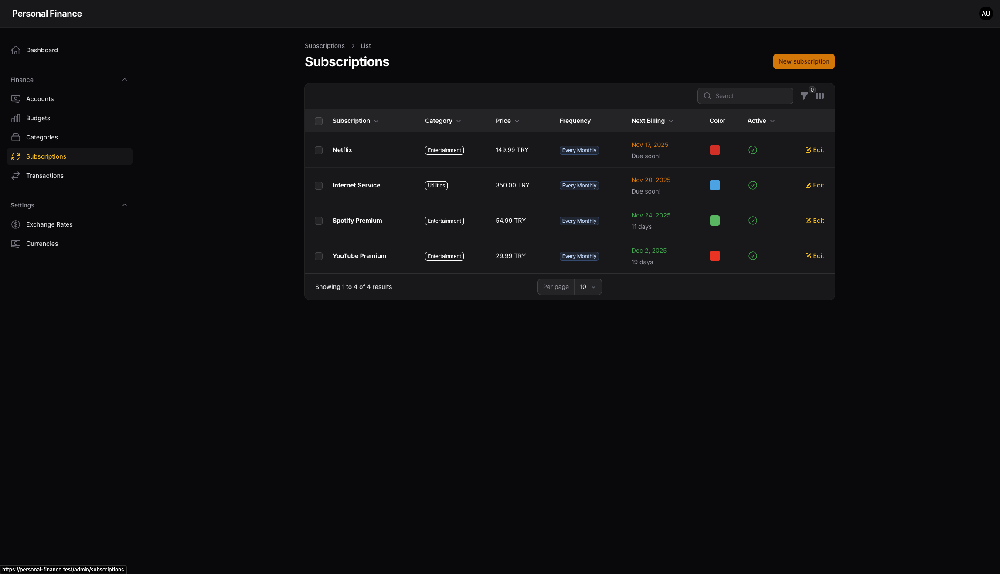

# 💰 Personal Finance Manager

<p align="center">
  
  
  
  
</p>

A modern, feature-rich personal finance management application built with Laravel 12 and Filament 4.2. Track your income, expenses, subscriptions, budgets, and manage multiple currencies with ease.

🔗 **Live Exchange Rates** powered by [finans.truncgil.com API](https://finans.truncgil.com/v4/today.json)

## 📖 Documentation

- 🚀 **[Quick Start Guide](QUICKSTART.md)** - Get started in 5 minutes
- 💱 **[Multi-Currency Guide](MULTI_CURRENCY_GUIDE.md)** - Currency features explained
- 🌐 **[Currency API Integration](CURRENCY_API_GUIDE.md)** - Live rate API details
- 💰 **[Currency Management](docs/CURRENCY_MANAGEMENT.md)** - Add/manage currencies from admin panel
- 📋 **[Complete Feature List](docs/FEATURES.md)** - All 100+ features documented
- 🔌 **[API Integration Guide](docs/API_INTEGRATION.md)** - Technical API documentation

## ✨ Features

### 💸 Financial Management
- **Multi-Currency Support** - Track transactions in TRY, USD, EUR, GBP, and JPY
- **Live Exchange Rates** - Real-time rate updates from Turkish Financial API
- **Exchange Rate Management** - Automatic currency conversion with historical rates
- **Categories** - Organize income and expense categories with colors and icons
- **Accounts** - Manage multiple accounts (Bank, Debit Card, Cash, Credit Card, Investment)
- **Transactions** - Record and track all financial transactions
- **Budgets** - Set and monitor category-based budgets (weekly, monthly, yearly)

### 🔄 Subscription Management
- **Recurring Subscriptions** - Track Netflix, Spotify, and other subscriptions
- **Auto-Payment Tracking** - Mark subscriptions for automatic or manual payment
- **Billing Alerts** - Get notified about upcoming payments
- **Subscription Analytics** - Link transactions to subscriptions for better tracking

### 📊 Analytics & Reports
- **Dashboard Overview** - Real-time financial statistics
- **Income vs Expense Charts** - Visual representation of last 12 months
- **Upcoming Subscriptions Widget** - 14-day preview of subscription payments
- **Latest Transactions** - Quick view of recent activity

### 🎨 Modern UI/UX
- **Filament Admin Panel** - Beautiful, responsive interface
- **Dark Mode Support** - Built-in theme switching
- **Color-Coded Categories** - Visual organization with custom colors
- **Smart Filters** - Advanced filtering and search capabilities

## 📋 Requirements
- **PHP** >= 8.2
- **Composer** >= 2.0
- **NPM** >= 9.x
- **Database** - SQLite, MySQL, or PostgreSQL
- **Laravel Valet/Herd** (optional, for local development)
- **Internet Connection** - For live exchange rate updates (optional, works offline with cached rates)

## ⚡ Quick Start

Want to get started quickly? Check out the [Quick Start Guide](QUICKSTART.md)!

```bash
composer setup  # One command to set up everything!
php artisan serve
# Visit: http://localhost:8000/admin
# Login: admin@admin.com / password
```

## 🚀 Installation

### 1. Clone the Repository

```bash
git clone https://github.com/SametGoktepe/personal-finance-app.git
cd personal-finance-app
```

### 2. Install PHP Dependencies

```bash
composer install
```

### 3. Environment Setup

Copy the example environment file and generate application key:

```bash
cp .env.example .env
php artisan key:generate
```

### 4. Database Configuration

Edit `.env` file and configure your database:

**For SQLite (Default):**
```env
DB_CONNECTION=sqlite
DB_DATABASE=/absolute/path/to/database/database.sqlite
```

**For MySQL:**
```env
DB_CONNECTION=mysql
DB_HOST=127.0.0.1
DB_PORT=3306
DB_DATABASE=personal_finance
DB_USERNAME=root
DB_PASSWORD=your_password
```

### 5. Create Database File (SQLite only)

```bash
touch database/database.sqlite
```

### 6. Run Migrations and Setup

**Option 1: Quick Setup (Recommended)**
```bash
composer setup
```

This single command will:
- Install dependencies
- Create .env file
- Generate app key
- Run migrations
- Seed sample data
- Fetch live exchange rates from API
- Install npm packages
- Build assets

**Option 2: Manual Setup**
```bash
php artisan migrate --seed
php artisan rates:update
```

This will create all necessary tables and seed sample data including:
- Admin user (email: admin@admin.com, password: password)
- Sample categories (Salary, Food, Entertainment, etc.)
- Sample accounts (Bank, Debit Card, Cash, Credit Card)
- Sample transactions
- Sample subscriptions (Netflix, Spotify, Internet, YouTube)
- **Live exchange rates from API** (USD, EUR, GBP, JPY)

### 7. Build Assets

```bash
npm run build
```

For development with hot reload:
```bash
npm run dev
```

### 8. Start the Application

**Using PHP Built-in Server:**
```bash
php artisan serve
```

**Using Laravel Herd/Valet:**
Already accessible at `http://personal-finance.test`

## 🔐 Default Login Credentials

- **Email:** admin@admin.com
- **Password:** password

⚠️ **Important:** Change these credentials after first login!

## 📚 Usage Guide

### Accessing the Admin Panel

Navigate to `/admin` route:
- `http://localhost:8000/admin` (artisan serve)
- `http://personal-finance.test/admin` (Herd/Valet)

### Managing Categories

**Finance > Categories**

Create income and expense categories with:
- Custom names
- Type (Income/Expense)
- Color coding
- Icons (Heroicons)
- Descriptions

### Managing Accounts

**Finance > Accounts**

Track multiple accounts:
- Bank Accounts
- Debit Cards
- Cash Wallets
- Credit Cards
- Investment Accounts

Each account supports:
- Multiple currencies
- Initial and current balance tracking
- Custom colors and icons

### Recording Transactions

**Finance > Transactions**

Record financial activities:
- Link to specific accounts
- Categorize transactions
- Multi-currency support with automatic exchange rates
- Optional subscription linking
- Recurring transaction support
- Reference numbers and notes

### Setting Up Budgets

**Finance > Budgets**

Create budget limits:
- Category-based budgets
- Weekly, Monthly, or Yearly periods
- Custom date ranges
- Progress tracking

### Managing Subscriptions

**Finance > Subscriptions**

Track recurring payments:
- Name and description
- Price and currency
- Billing frequency (Daily, Weekly, Monthly, Yearly)
- Next billing date
- Auto-payment flag
- Custom colors and icons

### Exchange Rates

**Settings > Exchange Rates**

Manage currency conversions:
- **Live API Integration** - Real-time rates from [finans.truncgil.com](https://finans.truncgil.com/v4/today.json)
- **One-Click Update** - "Update from API" button for instant rate refresh
- **Automatic Updates** - Daily scheduled updates at 09:00
- **Historical Rates** - Add and track rates over time
- Base currency: TRY (Turkish Lira)
- Automatic rate application in transactions
- Manual override capability

**Update Rates via Command:**
```bash
php artisan rates:update
```

## 🗂️ Project Structure

```
app/
├── Console/
│   └── Commands/
│       └── UpdateExchangeRates.php
├── Filament/
│   ├── Resources/          # CRUD resources
│   │   ├── Accounts/
│   │   ├── Budgets/
│   │   ├── Categories/
│   │   ├── ExchangeRates/
│   │   ├── Subscriptions/
│   │   └── Transactions/
│   └── Widgets/            # Dashboard widgets
│       ├── StatsOverview.php
│       ├── IncomeExpenseChart.php
│       ├── UpcomingSubscriptions.php
│       └── LatestTransactions.php
├── Models/                 # Eloquent models
│   ├── Account.php
│   ├── Budget.php
│   ├── Category.php
│   ├── ExchangeRate.php
│   ├── Subscription.php
│   ├── Transaction.php
│   └── User.php
├── Services/               # Business logic services
│   └── CurrencyService.php # Exchange rate API integration
└── Providers/
    └── Filament/
        └── AdminPanelProvider.php

database/
├── migrations/             # Database migrations
└── seeders/               # Sample data seeders

resources/
├── css/
│   └── app.css
└── js/
    └── app.js

routes/
├── console.php            # Scheduled tasks
└── web.php
```

## 🛠️ Development

### Running in Development Mode

Start all services simultaneously:

```bash
composer dev
```

This runs:
- Laravel development server
- Queue worker
- Log viewer (Pail)
- Vite dev server

### Code Style

Format code using Laravel Pint:

```bash
composer run lint
```

Or:

```bash
./vendor/bin/pint
```

### Running Tests

```bash
composer test
```

Or directly:

```bash
php artisan test
```

### Updating Exchange Rates

```bash
# Via composer script
composer update-rates

# Or directly
php artisan rates:update
```

## 🌍 Multi-Currency Configuration

The application uses **TRY (Turkish Lira)** as the base currency. All statistics and reports are calculated in TRY.

### Supported Currencies
- 🇹🇷 TRY - Turkish Lira (Base)
- 🇺🇸 USD - US Dollar
- 🇪🇺 EUR - Euro
- 🇬🇧 GBP - British Pound
- 🇯🇵 JPY - Japanese Yen

### Live Exchange Rate API

The application integrates with **Turkish Financial API** for real-time exchange rates:
- **API Endpoint:** [finans.truncgil.com](https://finans.truncgil.com/v4/today.json)
- **Auto-Updates:** Daily at 09:00
- **Manual Updates:** Available via admin panel or command line
- **Fallback:** Database rates used when API is unavailable

**Quick Update:**
```bash
php artisan rates:update
```

**Enable Scheduled Updates:**
```bash
php artisan schedule:work  # Development
```

For production, add to crontab:
```bash
* * * * * cd /path-to-project && php artisan schedule:run >> /dev/null 2>&1
```

### Changing Base Currency

To change the base currency, update:
1. Default currency in migrations
2. `getAmountInBaseCurrency()` method in Transaction model
3. Exchange rate calculation logic
4. Dashboard widgets
5. CurrencyService API integration

## 📊 Database Schema

### Main Tables
- `users` - User accounts
- `categories` - Income/Expense categories
- `accounts` - Financial accounts
- `transactions` - All financial transactions
- `subscriptions` - Recurring subscriptions
- `budgets` - Budget limits
- `exchange_rates` - Currency conversion rates

### Relationships
- Categories → Transactions, Budgets, Subscriptions
- Accounts → Transactions
- Subscriptions → Transactions
- Users → Accounts

## 🔒 Security

- Password hashing with bcrypt
- CSRF protection enabled
- SQL injection prevention via Eloquent ORM
- XSS protection with Blade templating
- Session security with encrypted cookies

## 📈 Performance

- Eager loading relationships to prevent N+1 queries
- Database indexing on foreign keys
- Query optimization with selective column loading
- Asset minification and bundling with Vite

## 🤝 Contributing

Contributions are welcome! Please follow these steps:

1. Fork the repository
2. Create a feature branch (`git checkout -b feature/AmazingFeature`)
3. Commit your changes (`git commit -m 'Add some AmazingFeature'`)
4. Push to the branch (`git push origin feature/AmazingFeature`)
5. Open a Pull Request

## 📝 License

This project is licensed under the MIT License - see the [LICENSE](LICENSE) file for details.

## 🙏 Acknowledgments

- [Laravel](https://laravel.com) - The PHP Framework
- [Filament](https://filamentphp.com) - Admin Panel Framework
- [Tailwind CSS](https://tailwindcss.com) - CSS Framework
- [Heroicons](https://heroicons.com) - Icon Library

## 📞 Support

If you encounter any issues or have questions:

1. Check the [documentation](docs/)
2. Search [existing issues](https://github.com/yourusername/personal-finance/issues)
3. Create a [new issue](https://github.com/yourusername/personal-finance/issues/new)

## 🔧 Artisan Commands

### Exchange Rate Management
```bash
# Update exchange rates from API
php artisan rates:update

# Run scheduled tasks (development)
php artisan schedule:work

# View all scheduled tasks
php artisan schedule:list
```

### Database Management
```bash
# Run migrations
php artisan migrate

# Seed database with sample data
php artisan db:seed

# Fresh migration with seed
php artisan migrate:fresh --seed
```

## 🗺️ Roadmap

- [x] Live API integration for exchange rates ✅
- [x] Subscription management system ✅
- [x] Multi-currency support ✅
- [x] Mobile responsive dashboard improvements
- [ ] PDF report generation
- [ ] Data export (CSV, Excel)
- [ ] Automated subscription renewal transactions
- [ ] Email notifications for upcoming payments
- [ ] Budget alerts and warnings
- [ ] Multi-user support with roles
- [ ] Receipt attachment support
- [ ] Advanced analytics and insights
- [x] More currencies from API

## 📸 Screenshots

### Dashboard


### Transactions


### Subscriptions


---

<p align="center">Made with ❤️ by Samet GOKTEPE</p>
<p align="center">
  <a href="https://github.com/SametGoktepe/personal-finance-app.git">⭐ Star this repo if you find it helpful!</a>
</p>
